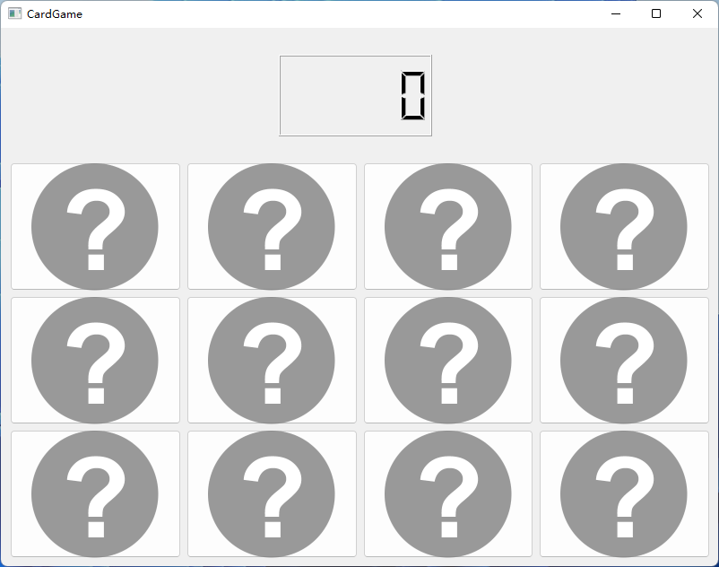
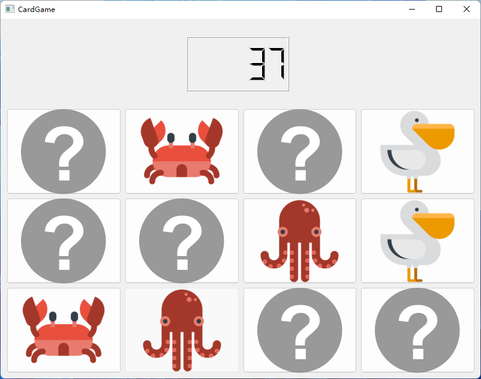
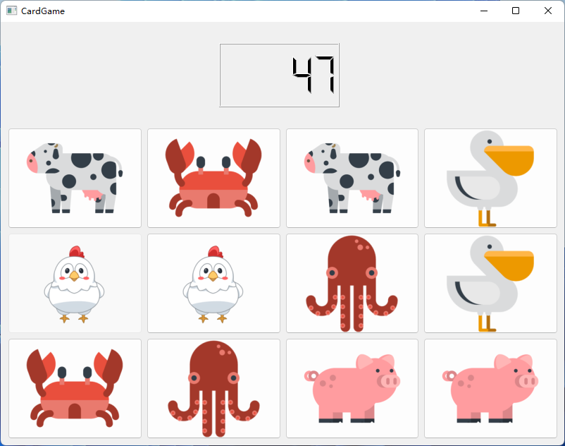

# CardGame
A simple card memorizing game.

## How to play?
Open the cards and match the animals!
When you open a card for the first time, the timer will start.
When you open all the cards, the timer will stop.

## Screenshots

